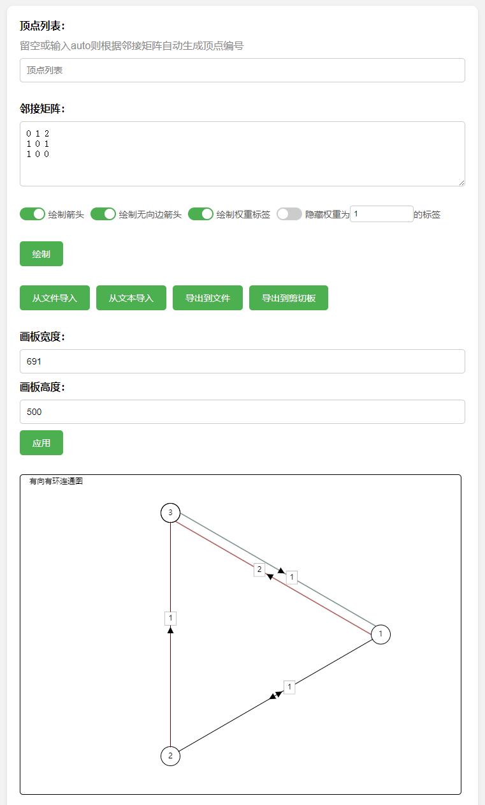
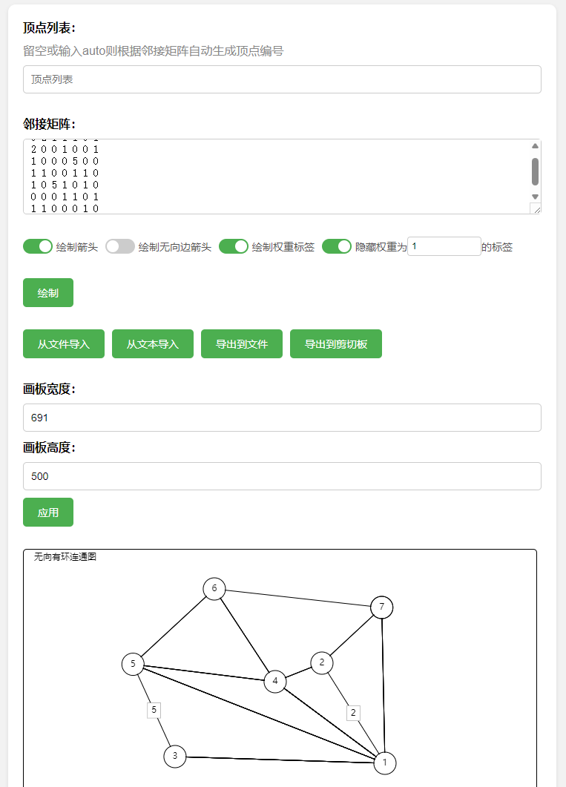

# HTML实现图的可视化


用户给出邻接矩阵和节点名称列表，在canvas上绘制出可视化的图

声明：本项目由[这个项目](https://github.com/ccessl/create_gra)改良而来

特性：

1. 用户输入图的邻接矩阵，使用canvas将图可视化，并且在节点间显示方向、箭头、权重
2. 自动识别无向图和有向图，自动识别边的类型
3. 用户可以随意拖动节点
4. 可设置是否绘制箭头、是否绘制权重标签
5. 可设置隐藏特定权重值的标签
6. 支持修改画板大小
7. 支持导出导入图(含绘图设置)，提供文件和文本两种导入导出形式
8. 页面根据设备宽度响应式调整，并且支持触屏设备
9. 不依赖任何第三方库
10. 单文件网页，用户可下载到本地打开运行


## 效果

[在线访问](https://xy0797.github.io/Visualizing-Graphs-with-HTML/web/)

### 有向图

邻接矩阵：

```
0 1 2
1 0 1
1 0 0
```

效果：


    
### 无向图

```
0 2 1 1 1 0 1
2 0 0 1 0 0 1
1 0 0 0 5 0 0
1 1 0 0 1 1 0
1 0 5 1 0 1 0
0 0 0 1 1 0 1
1 1 0 0 0 1 0
```




# Visualizing Graphs with HTML


Users provide an adjacency matrix and a list of node names to draw a visual representation of the graph on a canvas.

Disclaimer: This project is an improvement upon [this project](https://github.com/ccessl/create_gra).

Features:

1. Users input the adjacency matrix of the graph, and the graph is visualized using canvas, displaying direction, arrows, and weights between nodes.
2. Automatic detection of undirected and directed graphs, as well as edge types.
3. Users can freely drag nodes.
4. Option to enable/disable arrow drawing and weight labels.
5. Option to hide labels for specific weight values.
6. Support for modifying canvas size.
7. Support for exporting and importing graphs (including drawing settings) in both file and text formats.
8. Responsive page layout that adapts to device width, including support for touch devices.
9. No dependencies on any third-party libraries.
10. Single-file webpage that users can download and open locally.

## Demo

[Online Demo](https://xy0797.github.io/Visualizing-Graphs-with-HTML/web/)

### Directed Graph

Adjacency matrix:

```
0 1 2
1 0 1
1 0 0
```

Result:


### Undirected Graph

Adjacency matrix:

```
0 2 1 1 1 0 1
2 0 0 1 0 0 1
1 0 0 0 5 0 0
1 1 0 0 1 1 0
1 0 5 1 0 1 0
0 0 0 1 1 0 1
1 1 0 0 0 1 0
```

Result:

